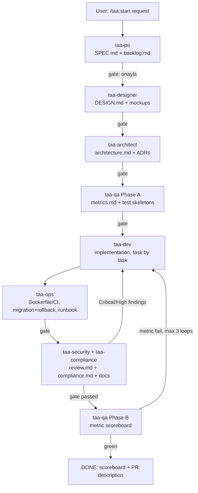

# TAA Pipeline — How it works

## Flow

## Design principles

1. **Separation of powers.** Each role is a separate subagent with its own context
   window and a least-privilege tool set (PO can't touch code; SEC can't change logic;
   DEV can't change requirements). The main session is a thin orchestrator.
2. **Human-in-the-loop gates.** Every stage ends with `onayla / düzelt / iptal`. The
   orchestrator is explicitly forbidden from self-approving or batching stages —
   this is what keeps the pipeline "adversarial" instead of a rubber stamp.
3. **Artifacts over vibes.** All decisions are frozen into `.taa/*.md` files. Subagents
   read prior artifacts instead of relying on conversation memory, so the pipeline
   survives session restarts (`/taa:continue`) and context compaction.
4. **Test-first, review-last.** QA writes failing skeletons before DEV starts; SEC is a
   blocking gate with evidence-based, severity-ranked findings.
5. **Advisory steering, human authority.** `taa-chief` (read-only Chief of Staff)
   briefs every gate — scope fidelity, budget, top risk, recommendation — and prepares
   dispute arbitrations and kill-switch analyses. It never approves anything: the
   constitution is SEC = "safe?", QA = "proven?", CHIEF = "worth it?" (advisory),
   human = "proceed?".
6. **Brownfield respect.** In existing codebases the architect's first job is
   reconnaissance and imitation, not invention.

## Context-budget notes

- Subagents keep noisy work (repo scans, test output, web research) out of the main
  session; only summaries return.
- DEV works one backlog task at a time; the orchestrator should not feed it the whole
  spec, only referenced sections.
- Inner DEV↔SEC and DEV↔QA-B loops are capped at 3 iterations before escalating to
  the human, preventing token-burning ping-pong.

## Customizing

- **Stack defaults** live in `CLAUDE.md` and `taa-architect.md` — change them once,
  every project inherits.
- **Add a role** by dropping a new `taa-*.md` into `.claude/agents/` and adding a row
  to the stage table in `.claude/commands/taa/start.md`.
- **Models:** each agent uses `model: inherit` by default. Pin cheaper models for
  read-heavy roles (e.g. `model: haiku` for `taa-qa` Phase B) in frontmatter, or set
  `CLAUDE_CODE_SUBAGENT_MODEL` for a session-wide ceiling.
- **Skills:** if you maintain Claude Code skills (e.g. team API conventions), preload
  them into a subagent with the `skills:` frontmatter field.

## FAQ

**Why not one giant prompt?** A single context degrades as it fills with repo scans and
test logs; isolated subagents keep the orchestrator sharp and make each role auditable.

**Can I skip stages?** Bugfixes under ~20 lines may skip to `/taa:review`. Anything with
a new endpoint, schema change, or UI surface goes through the full pipeline.

**Where does `.taa/` live in git?** Commit it. It's your spec, ADR and review history —
reviewers love it. Add `.taa/tests/bin|obj` style build noise to `.gitignore` if needed.
