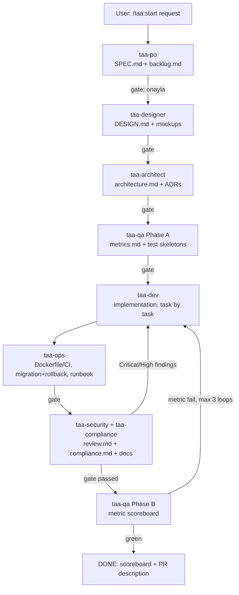

# TAA Pipeline — How it works

## Flow



## Directory layout — one folder per run

`.taa/` used to collect every stage's output as flat, fixed-name files
(`.taa/SPEC.md`, `.taa/architecture.md`, ...) directly overwritten on every
new pipeline run, with old runs' copies (`SPEC-<slug>.md`,
`architecture-<slug>.md`, ...) piling up loose next to them. In a project
with a dozen finished features this became 100+ ungrouped files, and any
agent instruction like "read existing `.taa/` files first" would sweep all
of them in — burning tokens on nine irrelevant past features to plan a
tenth. The layout now is:

```
.taa/
  runs/<run-id>/          the ONE active run (0 or 1 at a time per worktree)
    state.md              Track: CODE|FIX|DOCS|MARKETING|REFACTOR|RELEASE|UPGRADE|INCIDENT
                           Chief: full|light  (see "CHIEF opt-out" below)
    RESEARCH.md, SPEC.md, backlog.md, DESIGN.md, design/, architecture.md,
    invariants.md, metrics.md, tests/, review.md, compliance.md,
    data-review.md, DOCPLAN.md, runbook-*.md, brain-briefing.md ...
    (exactly the same filenames as before — just nested one level down)
  archive/<run-id>/       completed runs, moved here at the DREAM/completion step
  archive/INDEX.md        one line per archived run — see below
  inputs/                 doc-ingest output — cross-run, documents get reused
  explain/                taa-explainer reports — read-only track, not a gated run
  marketing/              already self-namespaced (YYYY-MM-DD-<channel>-<slug>.md)
  reports/                doc-export output
.taa-brain/                unchanged — cross-project institutional memory, never per-run
```

**Rules:**
- Every gated, multi-stage track (`/taa:start`, `/taa:fix`, `/taa:refactor`,
  `/taa:docs`, `/taa:marketing`, `/taa:release`, `/taa:upgrade`,
  `/taa:incident`) creates its own `.taa/runs/<run-id>/` at stage 0 and does
  all its reading/writing inside it. A `.taa/X.md` path named in any agent's
  instructions means `<run-dir>/X.md` — the orchestrator passes the resolved
  absolute run-dir path in every subagent task prompt, and each agent file
  says so explicitly near the top.
- **Agents never glob/grep `.taa/` outside the run directory they were
  given.** "Read existing `.taa/` files" always means "read existing files
  *in this run's directory*" — never a sweep of `.taa/runs/*` or
  `.taa/archive/*`.
- Only one run lives under `.taa/runs/` at a time (same single-active-run
  rule as before — use a git worktree per concurrent feature, see "Multiple
  concurrent runs" below).
- **Archiving.** When a run reaches DONE (after DREAM), the orchestrator
  moves `.taa/runs/<run-id>/` → `.taa/archive/<run-id>/` (`git mv` if
  tracked) and appends **one line** to `.taa/archive/INDEX.md`:
  `- <run-id> — <track> — <one-sentence outcome> — <YYYY-MM-DD>`.
  That index line is the only trace future pipeline runs see by default;
  the full archived folder stays on disk (and in git history) for anyone
  who deliberately opens it, but no agent reads into `archive/` unless the
  human explicitly points it at a past run.
- **CHIEF opt-out.** For a small/internal feature, `/taa:start` asks once at
  Stage 0: *"Basit bir feature — CHIEF her gate'te mi, yoksa sadece SEC
  gate'inde mi çalışsın?"* The answer is recorded as `Chief: full` (every
  gate, default) or `Chief: light` (only before the SEC gate and the final
  DREAM summary) in that run's `state.md`. Every stage's gate step checks
  this flag before invoking `taa-chief` — `light` skips roughly two-thirds
  of CHIEF's subagent invocations on a simple run without dropping the one
  advisory check that matters most (the safety gate).

## Design principles

1. **Separation of powers.** Each role is a separate subagent with its own context
   window and a least-privilege tool set (PO can't touch code; SEC can't change logic;
   DEV can't change requirements). The main session is a thin orchestrator.
2. **Human-in-the-loop gates.** Every stage ends with `onayla / düzelt / iptal`. The
   orchestrator is explicitly forbidden from self-approving or batching stages —
   this is what keeps the pipeline "adversarial" instead of a rubber stamp.
3. **Artifacts over vibes.** All decisions are frozen into `.taa/*.md` files. Subagents
   read prior artifacts instead of relying on conversation memory, so the pipeline
   survives session restarts (`/taa:continue`) and context compaction.
4. **Test-first, review-last.** QA writes failing skeletons before DEV starts; SEC is a
   blocking gate with evidence-based, severity-ranked findings.
5. **Advisory steering, human authority.** `taa-chief` (read-only Chief of Staff)
   briefs every gate — scope fidelity, budget, top risk, recommendation — and prepares
   dispute arbitrations and kill-switch analyses. It never approves anything: the
   constitution is SEC = "safe?", QA = "proven?", CHIEF = "worth it?" (advisory),
   human = "proceed?".
6. **Brownfield respect.** In existing codebases the architect's first job is
   reconnaissance and imitation, not invention.

## Context-budget notes

- Subagents keep noisy work (repo scans, test output, web research) out of the main
  session; only summaries return.
- DEV works one backlog task at a time; the orchestrator should not feed it the whole
  spec, only referenced sections.
- Inner DEV↔SEC and DEV↔QA-B loops are capped at 3 iterations before escalating to
  the human, preventing token-burning ping-pong.

## Customizing

- **Stack defaults** live in `CLAUDE.md` and `taa-architect.md` — change them once,
  every project inherits.
- **Add a role** by dropping a new `taa-*.md` into `.claude/agents/` and adding a row
  to the stage table in `.claude/commands/taa/start.md`.
- **Models:** each agent uses `model: inherit` by default. Pin cheaper models for
  read-heavy roles (e.g. `model: haiku` for `taa-qa` Phase B) in frontmatter, or set
  `CLAUDE_CODE_SUBAGENT_MODEL` for a session-wide ceiling.
- **Skills:** if you maintain Claude Code skills (e.g. team API conventions), preload
  them into a subagent with the `skills:` frontmatter field.

## Multiple concurrent runs

Only one directory lives under `.taa/runs/` per working tree — it's not
designed to interleave two unrelated feature pipelines at once. For parallel
features, give each its own `git worktree` (and therefore its own `.taa/`):

```bash
git worktree add ../myproject-licensing feature/licensing
cd ../myproject-licensing
# run /taa:start there — its own .taa/runs/<run-id>/, its own Run ID
```

Each worktree gets independent gates, independent brain-recall context (the
brain itself is still shared — it's global/project-scoped, not per-worktree),
and independent `.taa/runs/` artifacts that merge normally with the feature
branch. Don't run two `/taa:start` pipelines against the same working tree —
the orchestrator will refuse (it checks for an existing, non-archived
directory under `.taa/runs/`) and point you here instead.

## FAQ

**Why not one giant prompt?** A single context degrades as it fills with repo scans and
test logs; isolated subagents keep the orchestrator sharp and make each role auditable.

**Can I skip stages?** Bugfixes under ~20 lines may skip to `/taa:review`. Anything with
a new endpoint, schema change, or UI surface goes through the full pipeline.

**Where does `.taa/` live in git?** Commit it. It's your spec, ADR and review history —
reviewers love it — including `.taa/archive/`, which is the project's searchable pipeline
history. Add `.taa/runs/*/tests/bin|obj` style build noise to `.gitignore` if needed.
